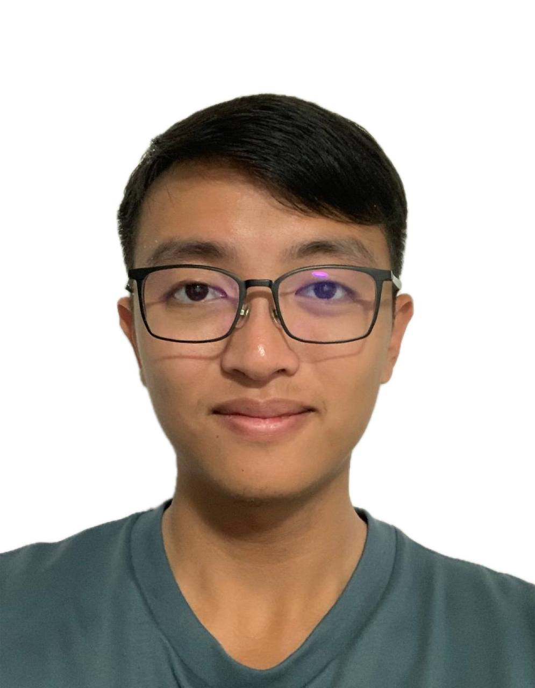

# About Us

We are a team based in the [School of Computing, National University of Singapore](http://www.comp.nus.edu.sg).

You can reach us at the email `seer[at]comp.nus.edu.sg`

## Project team

### John Doe

[[github](https://github.com/arcane-cs)]

* Role: Developer

### Benjamin Ong ZhenYu 

[[github](http://github.com/benjumpin)]

* Role: Developer 
* Responsibilities: Team Morale

### Yeo Xin Yu

[[github](http://github.com/YXY8899)]

* Role: Developer
* Responsibilities: Data

### Janelle Lum

[[github](http://github.com/jangleloom)]

* Role: Developer
* Responsibilities: Testing

### James Doe

[[github](http://github.com/johndoe)]
[[portfolio](team/johndoe.md)]

* Role: Developer
* Responsibilities: UI
